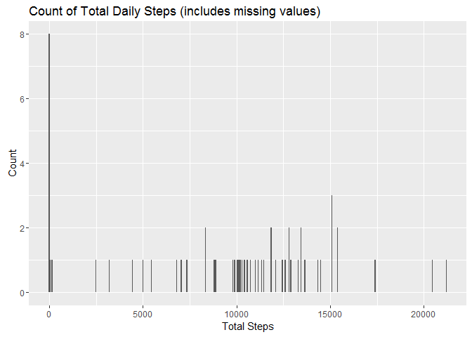
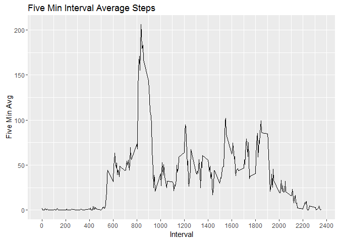
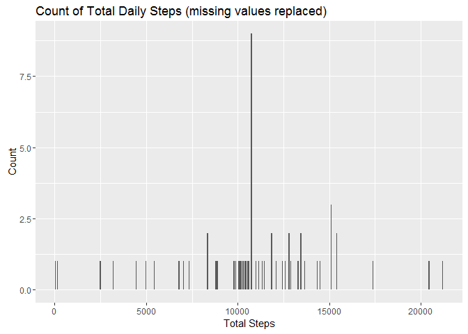
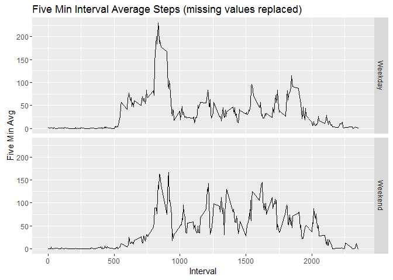

# Reproducible Research - Project 1
Danielle Desrosiers  
April 10, 2016  

<!-- note to myself... echo=FALSE in r chunk to prevent r code from printing in final document--> 
<!-- <http://rmarkdown.rstudio.com> -->

Code to turn off Scientific Notation from ["Stack Overflow"][1]

[1]: http://stackoverflow.com/questions/30888631/knitr-displaying-digits-of-an-integer-without-scientific-notation "Stack Overflow"


```r
knitr::opts_chunk$set(echo = TRUE)

inline_hook <- function(x) {
  if (is.numeric(x)) {
    format(x, digits = 2)
  } else x
}
knitr::knit_hooks$set(inline = inline_hook)

## Load the supporting packages

library(dplyr)
```

```
## 
## Attaching package: 'dplyr'
```

```
## The following objects are masked from 'package:stats':
## 
##     filter, lag
```

```
## The following objects are masked from 'package:base':
## 
##     intersect, setdiff, setequal, union
```

```r
library(ggplot2)
library(lubridate)
```

```
## 
## Attaching package: 'lubridate'
```

```
## The following object is masked from 'package:base':
## 
##     date
```

## Loading and preprocessing the data

**1. Load the data (i.e. read.csv())**  
**2. Process/transform the data (if necessary) into a format suitable for your analysis**

Set working directory and use read.csv2. Opting to set the class of the data explicitly during load


```r
setwd("C:/CourseraFiles")

activity <- read.csv2("activity.csv", 
                      header=TRUE, 
                      na.strings="NA",
                      sep=",", 
                      colClasses = c("integer", "Date", "integer"))
```

## What is mean total number of steps taken per day?

**1. Calculate the total number of steps taken per day**


```r
dailysteps <- activity %>% 
                group_by (date) %>% 
                summarize(totalsteps=sum(steps, na.rm=TRUE))

head(dailysteps)
```

```
## Source: local data frame [6 x 2]
## 
##         date totalsteps
##       (date)      (int)
## 1 2012-10-01          0
## 2 2012-10-02        126
## 3 2012-10-03      11352
## 4 2012-10-04      12116
## 5 2012-10-05      13294
## 6 2012-10-06      15420
```
**2. Make a histogram of the total number of steps taken each day **

Use ggplot2 to create a histogram of the total number of steps taken each day. 

```r
plot <- ggplot(dailysteps, aes(totalsteps))
plot <- plot + geom_histogram(binwidth=50)
plot <- plot + ggtitle("Count of Total Daily Steps (includes missing values)")
plot <- plot + xlab("Total Steps")
plot <- plot + ylab("Count")
plot
```

<!-- -->

**3. Mean and median number of steps taken each day**


```r
meanSteps <- mean(dailysteps$totalsteps, na.rm=TRUE)
medianSteps <- median(dailysteps$totalsteps, na.rm=TRUE)
```

The mean number of steps is 9354.  
The median number of steps is 10395.

## What is the average daily activity pattern?

**1. Make a time series plot (i.e. type = "l") of the 5-minute interval (x-axis) and the average number of steps taken, averaged across all days (y-axis)**

Create dataframe with five-minute average and line plot using ggplot2


```r
fiveminavg <- activity %>% 
                group_by(interval) %>% 
                summarize(fiveminavg = mean(steps, na.rm=TRUE))

plot <- ggplot(fiveminavg,  aes(x=interval, y=fiveminavg))
plot <- plot + geom_line()
plot <- plot + ggtitle("Five Min Interval Average Steps")
plot <- plot + xlab("Interval")
plot <- plot + ylab("Five Min Avg")
plot <- plot + scale_x_continuous(breaks = pretty(fiveminavg$interval, n = 10))
plot
```

<!-- -->

**2. Which 5-minute interval, on average across all the days in the dataset, contains the maximum number of steps?**

Make use of the dplyr arrange function to sort the dataframe. Using desc sort on the five-minute averages will put the highest value at the top of the list. Then subset to get the first value. 


```r
sortedFiveMinAvg <- fiveminavg %>% arrange(desc(fiveminavg))
maxInterval <- sortedFiveMinAvg[1,1]
maxSteps <- sortedFiveMinAvg[1,2]
```

The interval with the highest average number of steps (206.169811320755) is 835.  

## Imputing missing values

**1. Calculate and report the total number of missing values in the dataset (i.e. the total number of rows with NAs)**


```r
with(activity, table(is.na(steps)))
```

```
## 
## FALSE  TRUE 
## 15264  2304
```

**2. Devise a strategy for filling in all of the missing values in the dataset.**

I will be using the five-minute average to replace the missing values. 

**3. Create a new dataset that is equal to the original dataset but with the missing data filled in.**

Helpful mutate code found at ["Data Wranging - Hector Corrada Bravo"][2]

[2]: http://www.cbcb.umd.edu/~hcorrada/IntroDataSci/lectures/Wrangling.html#/24 "Data Wranging - Hector Corrada Bravo"

Using an inner join between the original activity dataframe and my five-minute average dataframe I can append the five-minute averages to the original dataframe. 

Then, I created a new imputedSteps column which uses the original value if it exists and the fiveminavg value if the original value is missing. 


```r
activity <- activity %>% inner_join(fiveminavg, by="interval")

activity <- activity %>%
                  mutate(imputedSteps = 
                        ifelse(!(is.na(activity$steps)), steps, 
                        fiveminavg))

head(activity)
```

```
##   steps       date interval fiveminavg imputedSteps
## 1    NA 2012-10-01        0  1.7169811    1.7169811
## 2    NA 2012-10-01        5  0.3396226    0.3396226
## 3    NA 2012-10-01       10  0.1320755    0.1320755
## 4    NA 2012-10-01       15  0.1509434    0.1509434
## 5    NA 2012-10-01       20  0.0754717    0.0754717
## 6    NA 2012-10-01       25  2.0943396    2.0943396
```

Confirm no missing values...


```r
with(activity, table(is.na(imputedSteps)))
```

```
## 
## FALSE 
## 17568
```

**4. Make a histogram of the total number of steps taken each day and Calculate and report the mean and median total number of steps taken per day. Do these values differ from the estimates from the first part of the assignment? What is the impact of imputing missing data on the estimates of the total daily number of steps?**


```r
updated_dailysteps <- activity %>% 
                group_by (date) %>% 
                summarize(totalsteps=sum(imputedSteps))

plot <- ggplot(updated_dailysteps, aes(totalsteps))
plot <- plot + geom_histogram(binwidth=50)
plot <- plot + ggtitle("Count of Total Daily Steps (missing values replaced)")
plot <- plot + xlab("Total Steps")
plot <- plot + ylab("Count")
plot
```

<!-- -->

```r
updated_meanSteps <- mean(updated_dailysteps$totalsteps)
updated_medianSteps <- median(updated_dailysteps$totalsteps)
```

The mean number of steps is 10766.  
The median number of steps is 10766.

The mean number of days increased from 9354 to 10766.  The median number of steps increased from 10395 to 10766.

The increase is because when the data is missing, it's missing for the entire day and the imputed step count for those days is the the sum of all the mean interval values. Thsi is shown below...note that there are 8 days with no data at all.


```r
activity %>% count(date, missing=is.na(steps)) %>% filter(missing==TRUE)
```

```
## Source: local data frame [8 x 3]
## Groups: date [8]
## 
##         date missing     n
##       (date)   (lgl) (int)
## 1 2012-10-01    TRUE   288
## 2 2012-10-08    TRUE   288
## 3 2012-11-01    TRUE   288
## 4 2012-11-04    TRUE   288
## 5 2012-11-09    TRUE   288
## 6 2012-11-10    TRUE   288
## 7 2012-11-14    TRUE   288
## 8 2012-11-30    TRUE   288
```

## Are there differences in activity patterns between weekdays and weekends?

**1. Create a new factor variable in the dataset with two levels - "weekday" and "weekend" indicating whether a given date is a weekday or weekend day.**


```r
activity <- activity %>%
                  mutate(typeOfDay = 
                        ifelse(wday(date) %in% c(1, 7) , "Weekend", "Weekday"))

head(activity, 10)
```

```
##    steps       date interval fiveminavg imputedSteps typeOfDay
## 1     NA 2012-10-01        0  1.7169811    1.7169811   Weekday
## 2     NA 2012-10-01        5  0.3396226    0.3396226   Weekday
## 3     NA 2012-10-01       10  0.1320755    0.1320755   Weekday
## 4     NA 2012-10-01       15  0.1509434    0.1509434   Weekday
## 5     NA 2012-10-01       20  0.0754717    0.0754717   Weekday
## 6     NA 2012-10-01       25  2.0943396    2.0943396   Weekday
## 7     NA 2012-10-01       30  0.5283019    0.5283019   Weekday
## 8     NA 2012-10-01       35  0.8679245    0.8679245   Weekday
## 9     NA 2012-10-01       40  0.0000000    0.0000000   Weekday
## 10    NA 2012-10-01       45  1.4716981    1.4716981   Weekday
```

**2. Make a panel plot containing a time series plot (i.e. type = "l") of the 5-minute interval (x-axis) and the average number of steps taken, averaged across all weekday days or weekend days (y-axis).**


```r
updated_fiveminavg <- activity %>% 
                group_by(interval, typeOfDay) %>% 
                summarize(fiveminavg = mean(imputedSteps))

plot <- ggplot(updated_fiveminavg, aes(x=interval, y=fiveminavg))
plot <- plot + geom_line()
plot <- plot + facet_grid(typeOfDay ~ .)
plot <- plot + ggtitle("Five Min Interval Average Steps (missing values replaced)")
plot <- plot + xlab("Interval")
plot <- plot + ylab("Five Min Avg")
plot
```

<!-- -->
        
        
        
        
